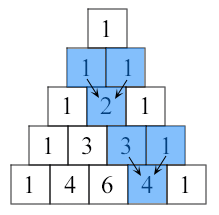

# Exercícios

1. Escreva uma função em Python para verificar se um número é "Perfeito" ou não.

    De acordo com a Wikipedia: Em matemática, um número perfeito é um número natural cuja a soma de todos os seus divisores naturais próprios (excluindo ele mesmo) é igual ao próprio número. Equivalentemente, um número perfeito é um número que é metade da soma de todos os seus divisores positivos (incluindo ele mesmo). Por exemplo, o número 28 é, pois: 28 = 1 + 2 + 4 + 7 + 14.

    Exiba os 5 primeiros números perfeitos.

2. Escreva uma função em Python que verifica se uma string passada é um palíndromo ou não.

    **Nota**: Um palíndromo é uma palavra, frase ou sequência que é lida da mesma forma de trás para frente, por exemplo, "madam" ou "socorram-me, subi no ônibus em Marrocos".

3. Escreva uma função em Python que imprime as primeiras n linhas do triângulo de Pascal.

    **Nota**: O triângulo de Pascal é uma figura aritmética e geométrica imaginada pela primeira vez por Blaise Pascal.

    Exemplo do triângulo de Pascal:

    <p>
        
    </p>

    Cada número é a soma dos dois números acima dele.

4.  Sua tarefa é desenvolver um jogo de adivinhação em que o jogador deve adivinhar um número secreto escolhido pelo computador.

    Aqui estão os requisitos do jogo:

    * O jogo deve pedir ao jogador que insira um número de 0 a 20 como seu palpite.
    * O computador deve escolher um número secreto aleatório entre 0 e 20.
    * O jogador deve ter um número limitado de tentativas para adivinhar o número secreto.
    * Após cada palpite do jogador, o computador deve fornecer uma dica para ajudar o jogador a se aproximar do número secreto.
    * O jogo deve terminar quando o jogador adivinhar corretamente o número secreto ou quando ele usar todas as suas tentativas.

    Nota: Para gerar um número aleatório, adicione a seguinte linha de código no seu programa:
    ```python
    ìmport random
    ```
    A partir dai você pode utilizar 
    ```python
    random.randint(1, 21)
    ```
    para gerar números aleatórios entre 1 e 20.
    
5. Determinar se uma solução de Sudoku fornecida é válida ou não.

    Você receberá uma grade de Sudoku 9x9 com alguns números preenchidos. Sua tarefa é escrever um programa que verifique se a solução fornecida está correta, ou seja, se atende a todas as regras do Sudoku.

    As regras do Sudoku são as seguintes:

    * Cada linha deve conter todos os números de 1 a 9, sem repetições.
    * Cada coluna deve conter todos os números de 1 a 9, sem repetições.
    * Cada subgrade 3x3 (também conhecida como "bloco" ou "região") deve conter todos os números de 1 a 9, sem repetições.

    Se a solução fornecida atender a todas essas regras, seu programa deve imprimir "Solução válida". Caso contrário, deve imprimir "Solução inválida".

    Você pode assumir que a entrada fornecida sempre será uma grade de Sudoku válida.

    Solução válida:

    5 3 4 | 6 7 8 | 9 1 2\
    6 7 2 | 1 9 5 | 3 4 8\
    1 9 8 | 3 4 2 | 5 6 7\
    ------+-------+------\
    8 5 9 | 7 6 1 | 4 2 3\
    4 2 6 | 8 5 3 | 7 9 1\
    7 1 3 | 9 2 4 | 8 5 6\
    ------+-------+------\
    9 6 1 | 5 3 7 | 2 8 4\
    2 8 7 | 4 1 9 | 6 3 5\
    3 4 5 | 2 8 6 | 1 7 9

    Solução inválida:

    5 3 4 | 6 7 8 | 9 1 2\
    6 7 2 | 1 9 5 | 3 4 8\
    1 9 8 | 3 4 2 | 5 6 7\
    ------+-------+------\
    8 5 9 | 7 6 1 | 4 2 3\
    4 2 6 | 8 5 3 | 7 9 1\
    7 1 3 | 9 2 4 | 8 5 6\
    ------+-------+------\
    9 6 1 | 5 3 7 | 2 8 4\
    2 8 7 | 4 1 9 | 6 3 5\
    3 4 5 | 2 8 6 | 1 7 8

6. Dado um conjunto de números inteiros positivos e uma soma alvo, escreva uma função recursiva para determinar se existe um subconjunto do conjunto dado cujos elementos somam à soma alvo.

    **Exemplo**:\
    Suponha que temos o seguinte conjunto de números inteiros positivos: [3, 7, 2, 8, 4], e nossa soma alvo é 14.
    Neste caso, queremos determinar se existe um subconjunto desse conjunto cujos elementos somam 14.

    Neste exemplo, a resposta é `sim´ porque podemos formar a soma 11 com o subconjunto [3, 7, 4].
    Cada elemento deste subconjunto soma 14 quando somado individualmente.

    **Dicas**:\
    Para resolver este problema de forma recursiva, podemos considerar duas possibilidades para cada elemento no conjunto:
    * Incluir o elemento atual no subconjunto e verificar recursivamente se existe um subconjunto com os elementos restantes que soma à soma alvo restante.
    * Excluir o elemento atual do subconjunto e verificar recursivamente se existe um subconjunto com os elementos restantes que soma à soma alvo original.
