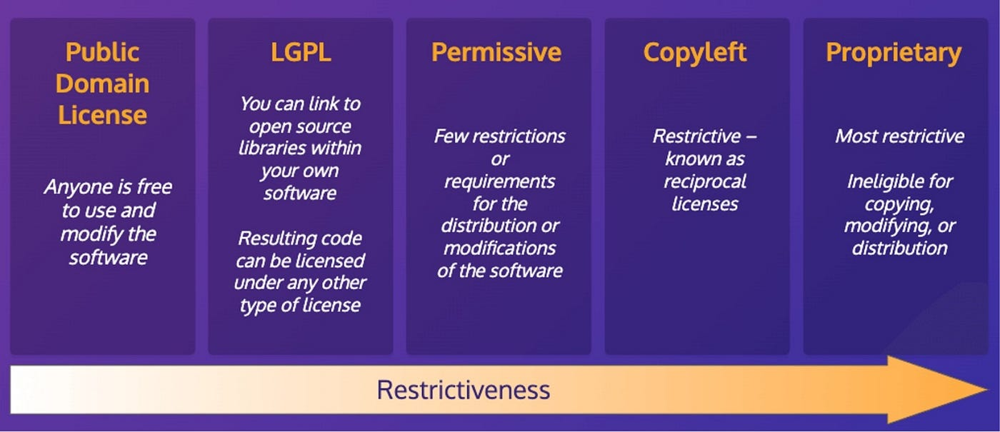

# Bibliotecas

Além de módulos e pacotes, também temos o conceito de bibliotecas.
Uma biblioteca em Python é um conjunto de módulos e pacotes que são distribuídos e instalados em conjunto para resolver problemas específicos ou oferecer funcionalidades adicionais.

```markdown
sound/                          Top-level package
├──── __init__.py               Initialize the sound package
├──── formats/                  Subpackage for file format conversions
│     ├────   __init__.py
│     ├────   wavread.py
│     ├────   wavwrite.py
│     ├────   aiffread.py
│     ├────   aiffwrite.py
│     ├────   auread.py
│     ├────   auwrite.py
│     └────   ...
├──── effects/                  Subpackage for sound effects
│     ├────   __init__.py
│     ├────   echo.py
│     ├────   surround.py
│     ├────   reverse.py
│     └────   ...
└──── filters/                  Subpackage for filters
      ├────   __init__.py
      ├────   equalizer.py
      ├────   vocoder.py
      ├────   karaoke.py
      └────   ...
```

**Observação**

É importante observar que, na prática, os termos "módulo", "pacote" e "biblioteca" são frequentemente usados de forma intercambiável. A distinção nem sempre é clara:

* Às vezes, "biblioteca" é usado para referir-se a qualquer coleção de módulos e pacotes.
* Um pacote pode ser considerado uma biblioteca se ele fornece uma coleção útil de funcionalidades.
* Um módulo pode ser chamado de biblioteca se ele é suficientemente grande e oferece funcionalidades significativas.

Portanto, ao conversar com outros desenvolvedores ou ler documentação, esteja ciente de que os termos podem ser usados de maneira flexível.

## Instalando

Por padrão, essas bibliotecas não vêm junto com o Python e devem ser instaladas separadamente, pois só são necessárias em contextos específicos.
Isso ajuda a evitar o uso desnecessário de espaço e mantém o ambiente de desenvolvimento mais leve e eficiente.
Por exemplo, bibliotecas como `requests` para fazer requisições HTTP, `numpy` para computação numérica, e `pandas` para manipulação de dados, precisam ser instaladas usando ferramentas de gerenciamento de pacotes como o pip (Pip Install Packages).

Por exemplo, para instalar a biblioteca `requests`, você pode usar o seguinte comando no terminal:
```bash
pip install requests
```

Isso baixará e instalará a biblioteca `requests` juntamente com suas dependências no ambiente Python.

## Usando

Depois de instalar uma biblioteca, você pode usá-la em seus programas Python da mesma maneira que usa módulos e pacotes.
Por exemplo, para usar a biblioteca requests para fazer uma solicitação HTTP, você pode fazer o seguinte:

```python
import requests

response = requests.get('https://api.github.com')
print(response.status_code)  # Saída: 200
```

Neste exemplo, importamos a biblioteca `requests` e usamos a função `get()` para fazer uma solicitação HTTP para a API do GitHub.

## Criando e Distribuindo Bibliotecas

Se você desenvolver uma funcionalidade que possa ser útil para outros programadores, você também pode criar sua própria biblioteca Python e distribuí-la para outros.
Para isso, você precisa criar um pacote Python e publicá-lo no PyPI (Python Package Index), que é o repositório oficial de pacotes Python.

Existem ferramentas como setuptools e twine que ajudam na criação e distribuição de pacotes Python.
Com essas ferramentas, você pode criar um arquivo `setup.py` que descreve sua biblioteca e seus requisitos de instalação, e então usar o `twine` para enviar sua biblioteca para o PyPI.

Uma vez que sua biblioteca esteja no PyPI, outros desenvolvedores podem instalá-la facilmente usando o `pip`.

## Licenças

Ao criar e distribuir uma biblioteca Python, é importante considerar a licença sob a qual você deseja disponibilizá-la. A licença define os termos de uso da sua biblioteca e pode afetar como outros desenvolvedores podem usá-la.

### Níveis de Restrição

As licenças  variam em seus níveis de restrição, desde permissivas até mais restritivas:

<p align="center">
  
</p>

#### Domínio Público
    
* Não impõem quaisquer restrições ao uso, modificação ou redistribuição do código-fonte.
* O código é essencialmente de propriedade pública e pode ser usado de qualquer maneira sem restrições de direitos autorais.
* Exemplos: Creative Commons Zero (CC0), Unlicense

#### Permissivas

* Permitem amplo uso, modificação e redistribuição do código, com poucas restrições.
* Podem ser usadas em projetos proprietários sem obrigar a adoção da mesma licença.
* Exemplos: MIT License, BSD License
* Exemplo prático: https://github.com/pandas-dev/pandas/blob/main/LICENSE

#### Copyleft
    
* Exigem que qualquer trabalho derivado seja distribuído sob os mesmos termos de licença do trabalho original.
* Garantem que as modificações e melhorias feitas ao software permaneçam acessíveis à comunidade de código aberto.
* Exemplos: GNU General Public License (GPL), GNU Lesser General Public License (LGPL)
* Exemplo prático: https://github.com/torvalds/linux?tab=License-1-ov-file#readme

### Proprietária
  
* Impõem restrições rigorosas sobre o uso, modificação e distribuição do software.
* O software é fornecido apenas em formato binário, e o acesso ao código-fonte é restrito.
* O uso é frequentemente limitado a condições específicas definidas pelo proprietário do software.
* Exemplos: Microsoft Windows EULA, Adobe Photoshop EULA
* Exemplo prático: https://www.nintendo.com/sg/support/switch/eula/usage_policy.html

## Bibliotecas para Ciência de Dados

### Computação Científica

#### NumPy

* Biblioteca fundamental para computação científica em Python.
* Fornece suporte para arrays e matrizes multidimensionais, além de uma coleção de funções matemáticas para operar nesses arrays.

#### SciPy

* Biblioteca que estende a funcionalidade do NumPy com funções adicionais para integração, otimização, álgebra linear, entre outras.
* Utilizada para tarefas científicas e de engenharia.

### Visualização de dados

#### Matplotlib

* Biblioteca de visualização de dados que permite a criação de gráficos estáticos, animados e interativos em Python.
* Utilizada para criar uma ampla variedade de gráficos, desde simples gráficos de linha até complexos gráficos 3D.

#### Seaborn

* Biblioteca baseada no Matplotlib para visualização estatística.
* Fornece uma interface de alto nível para desenhar gráficos estatísticos atraentes e informativos.

### Inteligência Artificial

#### Scikit-learn

* Biblioteca para aprendizado de máquina em Python.
* Oferece ferramentas simples e eficientes para análise e modelagem de dados, incluindo classificação, regressão, clustering e redução de dimensionalidade.

#### PyTorch

* Biblioteca de aprendizado de máquina desenvolvida pelo Facebook.
* Popular por sua facilidade de uso e flexibilidade, especialmente em pesquisa e desenvolvimento de redes neurais profundas.

### Processamento de Excel

#### Pandas

* Biblioteca essencial para manipulação e análise de dados.
* Oferece estruturas de dados como DataFrames, que facilitam a manipulação e análise de dados tabulares.

### Processamento de Texto

#### NLTK

* Plataforma para construção de programas Python para trabalho com dados de linguagem natural.
* Fornece interfaces fáceis de usar para mais de 50 corpora e recursos léxicos, como WordNet.

### Processamento de Imagem

#### Pillow

* Biblioteca amplamente utilizada para tarefas de manipulação de imagens.
* Adiciona suporte a formatos de imagem abertos e fornece ferramentas para criar, modificar e salvar arquivos de imagem.
