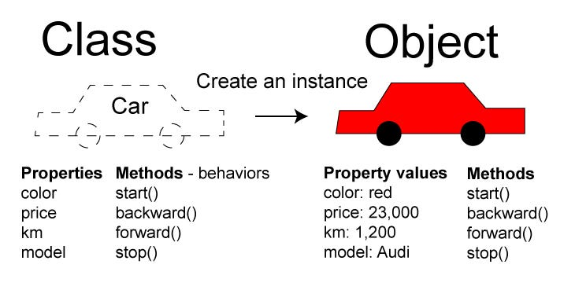

# Objetos e Classes

Em Python, tudo é um objeto.
Um objeto é como uma variável especial que pode armazenar multiplus valores 
e também possui funções associadas a ele.
Pense em um objeto como uma caixa que pode conter coisas e também fazer coisas.

Nesse contexto, uma classe é como uma receita para criar esses objetos especiais.
É como um modelo que define quais coisas (propriedades) e ações (funções) um objeto pode ter.

Seguindo essa linha de racíocinio, nos podemos considerar o conceito de ```carro``` como sendo uma receita (classe). 
Nela, um carro possue diversos valores (Números de Portas, Velocidade Máxima, etc) e ações (acelerar, direcionar, etc).
E você pode pensar em diversos outros exemplos similares como Televisões, Celulares, Roupas, etc

<p align="center">
  
</p>

Imagine que uma classe seja como uma receita para fazer algo, como um carro.
Essa receita detalha todos os aspectos do carro, como o número de portas, 
a velocidade máxima, a cor e assim por diante. Além disso, ela também inclui
todas as ações que um carro pode realizar, como acelerar, virar à esquerda, parar e assim por diante.

Agora, você pode aplicar essa mesma ideia para diferentes coisas, como televisões, celulares, roupas e muito mais.
Cada uma teria sua própria "receita" (classe) que define suas características e ações únicas.

Dessa forma, as classes servem como modelos ou receitas que nos permitem criar diferentes objetos 
com características e comportamentos específicos.

## Em python

Uma lista é um tipo de objeto em Python.
Podemos criar uma lista e adicionar elementos a ela usando funções
associadas a esse objeto.

```python
# Criando uma lista
minha_lista = [1, 2, 3, 4]

# Adicionando um elemento à lista
minha_lista.append(5)
```

Neste exemplo, ```minha_lista``` é o objeto (variável) que possui uma função 
chamada ```append()``` associada a ele, que adiciona um elemento à lista.

Então, você pode pensar em usar funções associadas a objetos como ```list_append(minha_lista, 5)```, 
mas em Python, podemos chamar essas funções de uma forma mais simples usando a notação de ponto ('.'), 
como minha_lista.append(5).

Outro tipo de objeto é a string, que é uma sequência de caracteres em Python.
Podemos criar uma string para representar texto e usar várias funções associadas a ela.
Por exemplo, podemos usar a função ```find()``` para encontrar a posição de uma determinada palavra dentro do texto.

```python
# Criando uma string
meu_texto = "Hello World!"

# Encontrando a palavra "World" no texto
posicao = meu_texto.find("World")
print(posicao)  # Saída: 6
```

E, como visto no exemplo anterior, pode-se pensar nesta função como sendo
```string_find(meu_texto, "World")```.

## Aviso

É importante deixar claro que não faz parte do escopo desta disciplina detalhar o funcionamento de classes, 
e até mesmo de como criar nossas próprias classes customizáveis.
A ideia aqui é apresentar superficialmente esse conceito, visto que, por trás dos panos, tudo é um objeto em Python.
Precisamos dessas ideias para entender melhor as estruturas de dados básicas, como Tuplas, Listas, Conjuntos,
Dicionários e Strings, que veremos a seguir.