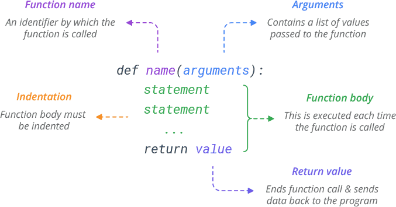

# Funções

Dado o que vimos até agora no curso, como criariamos um menu simples no terminal contendo operações a seguir?
1. Visualizar um texto informativo;
2. Calcular a área de um retângulo, solicitando ao usuário que insira os valores do comprimento e largura;
3. Sair do programa


Resposta:
```python
while True:
    print("Bem-vindo ao Menu:")
    print("1. Visualizar Texto Informativo")
    print("2. Calcular Área de um Retângulo")
    print("3. Sair")

    escolha = input("Digite o número da opção desejada: ")
    if escolha == '1':
        print("Texto informativo: Python é uma linguagem de programação poderosa e versátil.")
    elif escolha == '2':
        comprimento = float(input("Digite o comprimento do retângulo: "))
        largura = float(input("Digite a largura do retângulo: "))
        area = comprimento * largura
        print("A área do retângulo é:", area)
    elif escolha == '3':
        print("Saindo do programa. Até mais!")
        break
    else:
        print("Opção inválida. Por favor, digite um número válido.")
```

Qual sua opnião a respeito desse script?\
E, se fosse necessário adicionar mais items ao menu e, até mesmo, submenus?

## Introdução

Ao adicionar novos itens e submenus, é evidente que a complexidade do código acima pode crescer rapidamente, comprometendo sua organização e legibilidade.

Nesse contexto, é crucial compreender o papel que as **funções** tem Python, assim como em outras linguagens de programação.
Elas definem blocos de código reutilizáveis, estruturados para desempenhar tarefas específicas de forma eficiente e modular.
Utilizá-las traz uma série de benefícios fundamentais:

* **Simplificação e Organização**:\
Ao agrupar operações relacionadas em funções, o código torna-se mais organizado e legível, facilitando a compreensão e manutenção futura.
* **Reutilização de Código**:\
A capacidade de chamar uma função em diferentes partes do código elimina a necessidade de repetir blocos de código, promovendo a eficiência e a consistência do programa.
* **Flexibilidade e Adaptação**:\
Ao encapsular comportamentos em funções, é possível realizar alterações significativas no comportamento do programa sem a necessidade de modificar extensivamente o código principal.

### Exemplo

Uma função tem a seguinte estrutura:
```python
def saudacao(nome):
    print("Olá,", nome)
saudacao("Maria")
```

### Convertendo a aplicação acima...

Ao utilizarmos funções, podemos converter o código acima da seguinte forma:

```python
def exibir_menu():
    print("Bem-vindo ao Menu:")
    print("1. Visualizar Texto Informativo")
    print("2. Calcular Área de um Retângulo")
    print("3. Sair")

def exibir_texto_informativo():
    print("Texto informativo: Python é uma linguagem de programação poderosa e versátil.")

def calcular_area_retangulo():
    comprimento = float(input("Digite o comprimento do retângulo: "))
    largura = float(input("Digite a largura do retângulo: "))
    area = comprimento * largura
    print("A área do retângulo é:", area)

def main():
    while True:
        exibir_menu()
        escolha = input("Digite o número da opção desejada: ")
        
        if escolha == '1':
            exibir_texto_informativo()
        elif escolha == '2':
            calcular_area_retangulo()
        elif escolha == '3':
            print("Saindo do programa. Até mais!")
            break
        else:
            print("Opção inválida. Por favor, digite um número válido.")

main()
```

## Sintaxe

Uma função tem a seguinte sintaxe em python:

<p align="center">
  
</p>

## Tipos de argumentos / parâmetros
* **Argumentos**: São os valores passados para uma função durante sua chamada.
* **Parâmetros**: São as variáveis que recebem os valores dos argumentos dentro da função.


### Sequencial
Os argumentos são associados aos parâmetros com base em sua posição.

```python
def exibir_divisao(num, den):
    print("Divsão: ", num / den)
exibir_divisao(4, 2)
```

### Palavra-chave
Os argumentos são associados aos parâmetros usando seus nomes.
```python
def exibir_divisao(num, den):
    print("Divsão: ", num / den)
exibir_divisao(num=4, den=2)
```

### Valor padrão
Os parâmetros podem ter valores padrão, que são usados quando nenhum valor é fornecido durante a chamada da função.

```python
def exibir_divisao(num, den=1):
    print("Divsão: ", num / den)
exibir_divisao(4)
```

### Observações

* Os argumentos posicionais devem vir antes dos argumentos por palavra-chave durante a chamada da função.
* A ordem dos parâmetros na definição da função é crucial para os argumentos posicionais, mas não para os argumentos por palavra-chave.

## Lidando com argumentos variáveis (*args e **kwargs)
Às vezes, pode ser útil lidar com um número variável de argumentos em uma função. Para isso, podemos usar *args e **kwargs.

### *args
Permite passar um número variável de argumentos posicionais para uma função

```python
def exibir_soma(*args):
    total = 0
    for num in args:
        total += num
    print(total)
exibir_soma(1, 2, 3, 4, 5)
```

### **kwargs
Permite passar um número variável de argumentos por palavra-chave para uma função.

```python
def saudacao(**kwargs):
    for key, value in kwargs.items():
        print(f"{key} diz: {value}")

saudacao(Joao="Oi", Maria="Olá", Ana="Oi pessoal!")
```

### Observações:

* Os argumentos posicionais e por palavra-chave ainda podem ser usados em conjunto com *args e **kwargs.
* *args e **kwargs não são palavras reservadas, mas convenções amplamente utilizadas.
* É importante manter a clareza ao usar esses recursos para evitar confusões na leitura e manutenção do código.

## Retorno
Ao escrever funções em Python, é comum que elas retornem valores como resultado de suas operações.
O retorno de uma função é feito utilizando a instrução ```return```.

```python
def soma(a, b):
    resultado = a + b
    return resultado
print(soma(3, 5))
```

### Retorno de Múltiplos Valores
Uma função em Python também pode retornar múltiplos valores, separados por vírgula.

```python
def divide_e_resto(dividendo, divisor):
    quociente = dividendo // divisor
    resto = dividendo % divisor
    return quociente, resto

# Chamando a função e desempacotando os valores retornados
resultado, resto = divide_e_resto(10, 3)
print("Quociente:", resultado)
print("Resto:", resto)
```

### Retorno de Vazio (None)
Se uma função não especificar um valor de retorno utilizando a instrução ```return```, 
ela retorna automaticamente None.

```python
def funcao_sem_retorno():
    print("Esta função não tem retorno")
retorno = funcao_sem_retorno()
print(retorno) 
```

## Exercícios

1. Você foi contratado por uma loja para criar uma função que calcule o valor total das compras de um cliente, levando em consideração os descontos aplicáveis. A loja oferece os seguintes descontos com base no valor total das compras:

    * 10% de desconto para compras acima de R$ 500,00.
    * 20% de desconto para compras acima de R$ 1000,00.
    * 30% de desconto para compras acima de R$ 1500,00.

    Escreva uma função chamada ```calcular_total_compras``` que receba como argumento o valor total das compras e retorne o valor total a ser pago após aplicar os descontos.

    Teste a corretude dá sua função, utilizando os seguintes valores: R$ 400, R$ 600, R$ 1200, R$ 1800.

2. Você foi designado para criar uma função que normalize um texto, permitindo apenas letras e espaços, convertendo todas as letras para minúsculas e emovendo espaços extras entre as palavras.

    Escreva uma função chamada ```normalizar_texto``` que receba uma string como entrada e retorne o texto normalizado.

    Teste a corretude dá sua função, utilizando o seguinte texto:
    ```"Olá, este é um texto com! @caracteres especiais e espaços    extras  ."```
